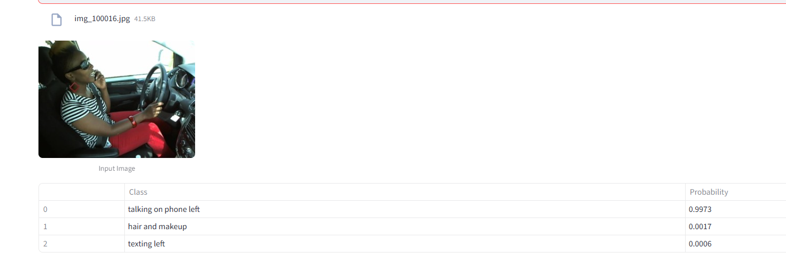
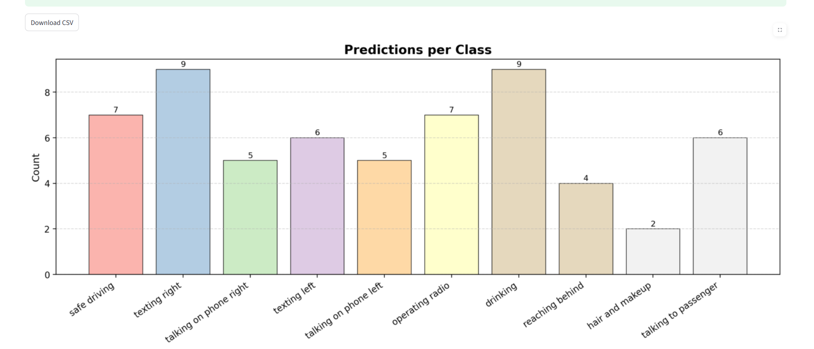
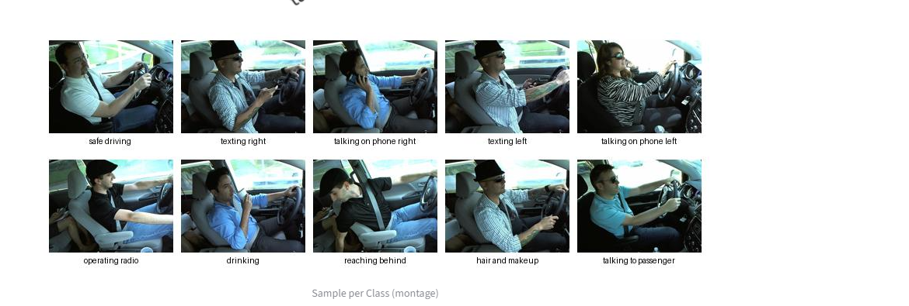
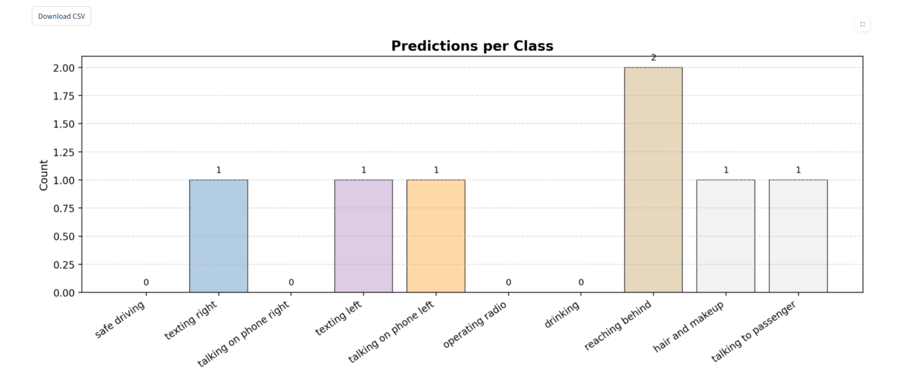
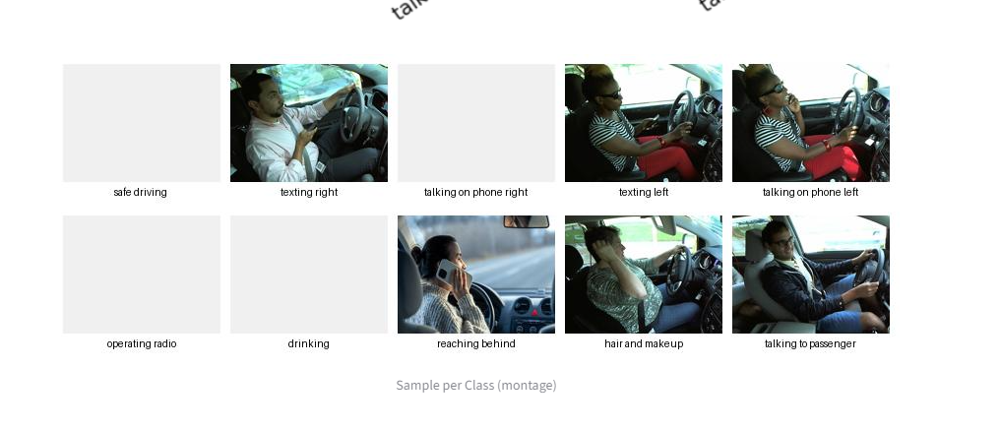

# DistractedDriverAI
An interactive CNN-based app for detecting distracted driving activities from images. Supports multiple uploads, fast predictions, and CSV export. Built with Streamlit for road safety analysis and real-time driver behavior monitoring.

This project detects driver states (safe or distracted) using multiple deep learning architectures, and compares their performance to select the best model for deployment.

---

## 📂 Dataset
- **Source**: [State Farm Distracted Driver Detection](https://www.kaggle.com/c/state-farm-distracted-driver-detection)
- **Classes**:
  1. c0 - Safe driving
  2. c1 - Texting (right hand)
  3. c2 - Talking on the phone (right hand)
  4. c3 - Texting (left hand)
  5. c4 - Talking on the phone (left hand)
  6. c5 - Operating the radio
  7. c6 - Drinking
  8. c7 - Reaching behind
  9. c8 - Hair and makeup
  10. c9 - Talking to passenger
 
  11. ## 🧠 Models Trained & Results

During the project, we trained and evaluated six different models to classify driver behaviors from images.  
The dataset was split into training, validation, and test sets, and all models were evaluated using Accuracy, Precision, Recall, and F1 Score.

| Model                        | Accuracy  | Precision | Recall   | F1 Score |
|------------------------------|-----------|-----------|----------|----------|
| Custom CNN                   | 0.9564    | 0.9585    | 0.9564   | 0.9566   |
| MobileNet (Adam, LR=0.005)   | 0.9783    | 0.9793    | 0.9783   | 0.9780   |
| MobileNet (Adam, LR=0.001)   | 0.9835    | 0.9843    | 0.9835   | 0.9836   |
| MobileNet (SGD)              | 0.9865    | 0.9867    | 0.9865   | 0.9866   |
| ResNet (Adam)                | 0.4184    | 0.4500    | 0.4184   | 0.3930   |
| ResNet (SGD)                 | **0.9972**| **0.9972**| **0.9972**| **0.9972**|

### 📌 Key Insights
- **Best Performer**: **ResNet (SGD)** achieved the highest accuracy (99.72%), outperforming all other models.
- **Close Competitors**: MobileNet (SGD) and MobileNet (Adam, LR=0.001) also achieved high performance with accuracy above 98%.
- **Underperformance**: ResNet (Adam) significantly underperformed, likely due to unsuitable learning rates or convergence issues.
- Custom CNN delivered solid results but did not match the performance of optimized pre-trained architectures.

### 📊 Accuracy Comparison Chart

## 🚀 Streamlit App Demo

We deployed our trained model in an interactive **Streamlit** web application.  
Users can upload an image or a batch of images (ZIP), and the app predicts the driver's activity.

🔗 **Try it here:** [Distracted Driver Detection App]([https://your-streamlit-link.streamlit.app/](https://distracteddriverai-czdeatambsdkpupwbvwaee.streamlit.app/))

---

### 🖼 App Screenshots

#### 1️⃣ Single Image Prediction

#### 2️⃣ Batch ZIP Prediction

#### 3️⃣ Prediction Results Visualization

> The chart above visualizes the accuracy of each model, making it easier to compare performance at a glance.
